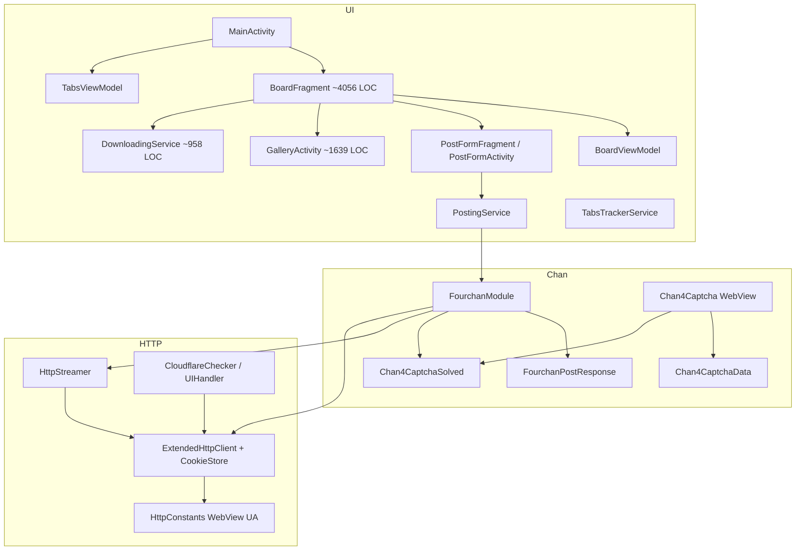
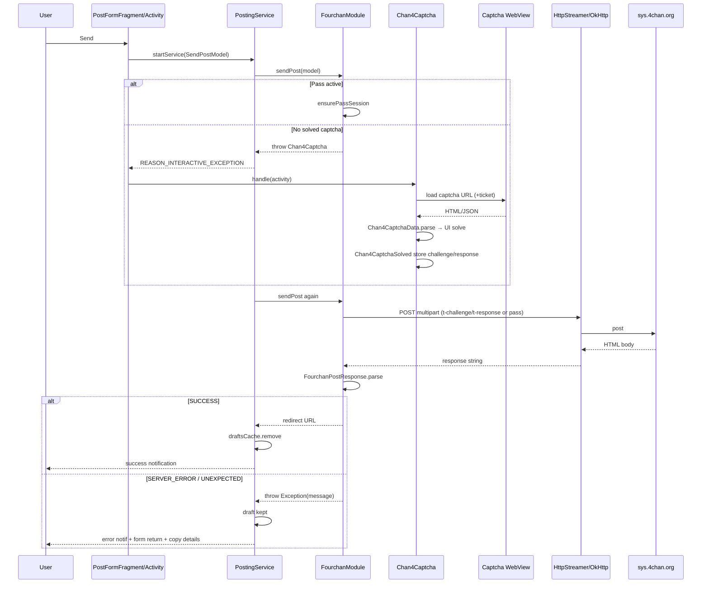
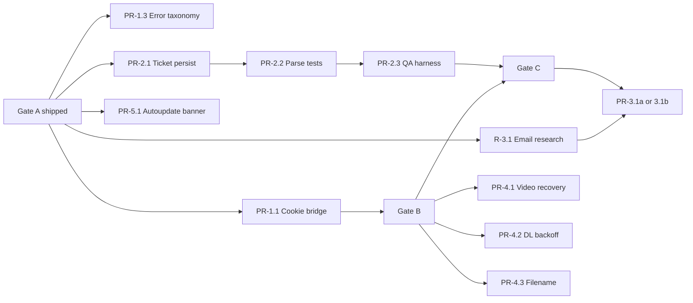

# esochan Post-1.0 Improvement Program

| Field | Value |
|-------|--------|
| **Document** | Post-1.0 Improvement Program (consolidated execution plan) |
| **Author** | — |
| **Date** | 2026-07-11 |
| **Status** | Ready for Implementation |
| **Supersedes for execution** | `docs/plans/2026-07-08-posting-reliability-orchestrated-plan.md`, competitor investigation, visual-refresh remainder, modernization architecture remainder |
| **Related frozen inventories** | Still useful as history: competitor complaint map (2026-07-08), visual-refresh plan (phases 0–4 largely done) |
| **Baseline product** | v1.0.0 (2026-07-09), package `dev.esoc.esochan` |

---

## Overview

esochan is a GPLv3 4chan Android client forked from Overchan. Platform modernization (SDK 35, OkHttp, Media3, Jsoup, Kryo 5, secure prefs, CI, 4chan-only product scope) shipped in **v1.0.0**. The remaining program is not another platform lift: it is **posting correctness and transport integrity first**, then captcha resilience, optional email-verify, media/download resilience, reading UX signals, and only then incremental architecture debt reduction and visual/distribution polish.

This document consolidates four plan files into one implementable strategy. It is grounded in **code as of 2026-07-11**, not the July 8 plan freeze. Notably, **Tier 0 (fail-closed post response) already shipped in 1.0.0** and must not be re-planned as open work. Older plans and `docs/plans/README.md` point here as the **only execution SSOT**.

**Execution priority (matches critical path; not just theme labels):**

1. **Captcha / Cloudflare transport integrity** — cookie bridge (PR-1.1) then ticket persistence (PR-2.1)
2. **Posting reliability residual** — error taxonomy / UX distinctions (PR-1.3; parallel with 1.1, not Gate B-blocking)
3. Email verify: research → implement or WONTFIX
4. Media / download resilience
5. Reading UX signals
6. Architecture debt reduction (BoardFragment / Gallery / MainActivity carve-outs)
7. Visual/M3 polish + F-Droid (lower-priority parallel track)

Outcome themes (reliability, captcha, media, …) still map to market pain; **sequence for merge is the numbered list above and the PR DAG**, not “taxonomy before cookies.”

---

## Background & Motivation

### Market pain (from competitor investigation)

Users leave Read Chan / KurobaEx / Chance when:

- Captcha breaks after 4chan changes while lurking still works
- Post errors are empty or false-success (draft loss)
- Range bans require email verify or Pass and clients only half-support either
- Video stalls; batch downloads die or look bot-flaggy
- Soft-bans feel worse in native clients than in Chrome (cookie/UA/TLS fingerprint)

### What 1.0.0 already fixed

| Area | 1.0.0 reality |
|------|----------------|
| Null-as-success / draft wipe | **Fixed** — `FourchanPostResponse` + `doSendPost` throws on non-success; draft cleared only after success |
| Platform stack | OkHttp 4.12, Media3, Jsoup, Kryo 5, minSdk 24 / target 35 |
| Security prefs | Pass token/pin/cookie in `SecurePreferences` (`EncryptedSharedPreferences`) |
| ACRA / remote crash | Removed; no remote telemetry by design |
| 4chan scope | Only `FourchanModule` registered in `MainApplication` |
| Captcha product path | Live slider / image-task via WebView (`Chan4Captcha*.kt`) |
| Visual chrome | Adaptive icons, tinted vectors, AndroidX Preference settings hub, drawer/board/gallery polish |
| Tests | `FourchanPostResponseTest`, cookie store, HTTP stream, tabs, attachments |

### Why a single program doc

Engineers were re-deriving order from four overlapping plans. This document is the **single source of truth for execution**. Prior plans remain as research appendix; they should not drive PR order without reconciling against this doc’s **Current Truth** table.

---

## Goals & Non-Goals

### Goals

1. Users never see success for a failed/unknown post; drafts survive failures (already true — keep invariant).
2. Captcha + CF solve can complete and POST on Wi‑Fi and cellular with a shared cookie jar after captcha WebView work.
3. Captcha ticket survives process death for a documented TTL when the site still issues tickets.
4. Post errors are human-readable classes (ban / captcha / flood / unexpected) with copy-details (partially present).
5. Batch download survives 50+ files without silent full abort; true rate limits (429; carefully gated 403) back off without wedging CF interactive flows.
6. Video failure offers retry / open external; download progress remains visible.
7. Optional upload filename randomize (extension-preserving rename only).
8. Autoupdate/404 failure is visible in-thread, not only sidebar `[X]`.
9. BoardFragment complexity reduced incrementally without rewrite.
10. Sideload releases gated by device QA checklists, not remote telemetry.

### Non-Goals (explicit)

| Non-goal | Why |
|----------|-----|
| Jetpack Compose rewrite | XML + Material Components sufficient; huge blast radius |
| Hilt/Dagger | Singleton/`MainApplication` works at this scale |
| Navigation Component retrofit | Fragment/tab model is core UX; retrofit pain > value |
| Full Kotlin rewrite | ~169 Java files; migrate opportunistically only |
| Modularization | Single-module is correct for app size |
| Captcha auto-solvers / paid APIs | ToS/legal risk; product decision required to reverse |
| Multi-chan re-enable | Keep architecture; re-add only after 4chan posting is solid |
| Matching Read Chan gestures 1:1 | Reliability > chrome |
| Play Store strategy | Out of scope of this program |
| Room / DataStore migration in this program | Deferred unless a schema change forces it |
| Progressive video streaming as a hard requirement | Spike only; default remains download-then-play |

---

## Current Architecture Snapshot

Verified paths under `src/dev/esoc/esochan/`.

### High-level component map



### Entry points

| Surface | Path | Role |
|---------|------|------|
| Application | `common/MainApplication.java` | Singleton locator; constructs only `FourchanModule`; notification channels; caches |
| Main shell | `ui/MainActivity.java` (~1059 LOC) | Drawer, tabs, hosts `BoardFragment` |
| Board/thread UI | `ui/presentation/BoardFragment.java` (~4056 LOC) | Rendering, menus, hide, post form open, download-all, search |
| Page load state | `ui/presentation/BoardViewModel.kt`, `BoardUiState.kt` | Coroutine load/refresh; post-success expect-post retries |
| Tabs | `ui/tabs/TabsState`, `TabsAdapter`, `TabsViewModel.kt`, `TabsTrackerService` | Tab list + autoupdate |
| Posting draft (in-board) | `ui/posting/PostFormFragment.kt` | Compose/reply sheet; draft fields; starts `PostingService` |
| Posting form + error return | `ui/posting/PostFormActivity.java` | Standalone form; **error dialog + copy details** (`showPostingError`); interactive captcha return path |
| Posting worker | `ui/posting/PostingService.java` | Background `sendPost`; draft clear on success only |
| Gallery | `ui/gallery/GalleryActivity.java` | AttachmentGetter full download → Media3 ExoPlayer |
| Downloads | `ui/downloading/DownloadingService.java` | Sequential `LinkedBlockingQueue` worker |
| Secure storage | `common/SecurePreferences.kt` | EncryptedSharedPreferences file `secure_prefs` |

### Posting path (current)



Critical files:

- `chans/fourchan/FourchanModule.doSendPost` — multipart build, headers, parse
- `chans/fourchan/FourchanPostResponse` — `SUCCESS | SERVER_ERROR | UNEXPECTED`
- `ui/posting/PostingService.PostingTask.sendPost` — success ⇒ clear draft; exception ⇒ keep draft
- Email field: `addString("email", model.sage ? "sage" : "")` — **any real email discarded**
- Board flag: `FourchanJsonMapper` sets `allowEmails = false`, `allowRandomHash = false`

### Captcha path (current)

- `Chan4Captcha.handle` → WebView fetch of `https://sys.4chan.org/captcha?board=…&thread_id=…&ticket=…`
- Deliberately WebView to avoid Cloudflare TLS fingerprint mismatch vs pure OkHttp
- `Chan4CaptchaData` sealed: `Noop`, `Cooldown`, `Error`, `Slider`, `ImageSelection`
- Ticket: `Chan4Captcha.storedTicket` — **`@Volatile` process memory only**
- Solved payload: `Chan4CaptchaSolved` one-shot between solve and POST
- **No** `CookieManager` → OkHttp merge after captcha WebView (contrast CF path)

### Cloudflare path (works; pattern to reuse)

```text
CloudflareChecker (WebView) 
  → extracts cf_clearance from CookieManager
  → CloudflareUIHandler 
  → ChanModule.saveCookie 
  → ExtendedHttpClient.CookieStore.addSecureCookie
  → CloudflareChanModule also persists clearance value/domain to prefs
```

Captcha WebView does **not** call this bridge after challenge-inside-captcha. Primary gap is **`cf_clearance`** (same name the CF path already bridges). v1 cookie bridge is **name-allowlisted** (see PR-1.1), not a full jar dump.

### Download path (current)

- Gallery: `AttachmentGetter` → `GalleryRemote.getAttachment` full file → `setVideo` / `MediaItem.fromUri(Uri.fromFile(file))`
- Sibling cancel: `recycleTag(..., true)` on page change — **already works**
- Batch: `BoardFragment.downloadAllImages` enqueues items into `DownloadingService`
- Worker: single-thread poll of `LinkedBlockingQueue`; per-item `addError` and **continue**
- No inter-item delay, no 429/403 backoff, no pause/resume for rate limits

### Tab state (current)

- `TabsState` + Kryo serialization remain source of truth
- `TabsViewModel` re-emits `StateFlow` after `TabsAdapter` mutations and tracker updates — **does not own mutations**
- Autoupdate errors: `TabModel.autoupdateError` → sidebar title prefix `[X]` via `TabsAdapter`; in-thread is toast via `BoardFragment.showUpdateError` on load error (not a persistent banner)

### Size hotspots (LOC, 2026-07-11)

| File | LOC |
|------|-----|
| `BoardFragment.java` | ~4056 |
| `GalleryActivity.java` | ~1639 |
| `MainActivity.java` | ~1059 |
| `DownloadingService.java` | ~958 |
| `FourchanModule.java` | ~903 |
| `Chan4Captcha.kt` | ~523 |
| `PostingService.java` | ~482 |

---

## Problem Framing — Verified Current Truth

Re-verified against tree **after** v1.0.0. Do not re-open fixed items as if July 8 freeze were current.

| Finding | Severity | Status 2026-07-11 | Evidence |
|---------|----------|-------------------|----------|
| Unknown post HTML treated as success / draft cleared | P0 | **FIXED in 1.0.0** | `FourchanPostResponse`; `doSendPost` throws; tests in `FourchanPostResponseTest` |
| Unexpected body logging | P0 residual | **Partial** | User message includes snippet; DEBUG full capture via `logPostResponseForCapture`; release relies on message + copy details |
| Error taxonomy (ban/captcha/flood/…) | P1 | **Open** | Raw `errmsg` text only; no stable string resources / typed classes |
| Captcha WebView cookies not bridged to OkHttp | P0 | **Open** | No CookieManager sync in `Chan4Captcha.kt`; CF path only for `cf_clearance` |
| Captcha ticket process-memory only | P0 harden | **Open** | `@Volatile storedTicket` companion |
| Email field discarded; no verify flow | P0 product | **Open / research** | `allowEmails=false`; POST email sage/empty |
| POST headers thin vs Chrome | P2 opportunistic | **Open** | Origin + Referer + Accept only in `getPostHeaders` |
| Shared WebView UA | good | **Done** | `HttpConstants.getUserAgentString()` |
| Video full-download then play | P1 UX | **Confirmed** | `AttachmentGetter` then `Uri.fromFile` |
| Gallery sibling cancel | — | **Done** | `recycleTag` |
| ExoPlayer error UX | P1 | **Weak** | Log + `showError` / `frame_error`; no dedicated retry+external actions on play failure |
| Batch DL sequential + continue | good base | **Confirmed** | `DownloadingService.run` |
| 429/403 backoff + delay pref | P1 | **Open** | None |
| Filename randomize on 4chan | P2 | **Open** | `allowRandomHash=false`; `uniqueHash` mutates content tail, not filename |
| Hide/unhide | — | **Done** | DB + menus; no program work |
| 404 wipe thread | myth | **No wipe** | Cache preserved; weak signal only |
| Autoupdate signal | P2 | **Weak** | Sidebar `[X]` + toast |
| BoardViewModel page load | arch | **Started** | Load/Updated/Error; fragment still owns rendering/menus/DB |
| Visual refresh phases 0–4 | parallel | **Mostly done** | Settings, icons, drawer, board/gallery chrome |
| Material 3 full theme | parallel low | **Open** | Material Components Bridge themes |
| F-Droid | parallel low | **Open** | ROADMAP |

### Competitor complaint → residual work map

| Complaint | Residual program work |
|-----------|----------------------|
| Captcha/posting broken | Cookie bridge, ticket TTL, parse resilience, device QA harness |
| Opaque / false post errors | Taxonomy + keep Unexpected distinct (fail-closed already) |
| Email verify | Research gate → 3.1a or 3.1b |
| Soft-ban vs browser | Cookie bridge + optional header parity; no pure-OkHttp captcha |
| Video stalls | Progress clarity + error recovery; stream spike optional |
| Batch DL dies | Throttle/backoff on sequential queue |
| Filename leak | Rename-only option |
| Deleted thread wipe | Signal only (banner); no archive mode |

---

## Proposed Design

### Operating principles

1. **Correctness before features.** Residual posting/transport before filename/video polish.
2. **Small vertical PRs.** One failure mode per PR; app remains postable after each merge.
3. **Evidence gates.** Device QA for captcha/POST; CI for unit tests/lint only.
4. **Fail closed for user-visible success.** Unknown HTML is error (already). Taxonomy must not invent success markers.
5. **Do not “optimize” fingerprint paths.** Captcha stays WebView-backed unless dual-path A/B proves OkHttp-only safe.
6. **Preserve working behavior.** Sequential downloads, gallery sibling cancel, hide/unhide, Pass, shared UA, fail-closed parse.
7. **No remote telemetry.** Local logs only; manual soft-launch for parse regressions.
8. **Dependency DAG.** Later tiers design early; code lands when deps merge.

### Tier model (post-1.0 renumber with frozen Gate A)

```text
Gate A  ALREADY GREEN (v1.0.0) — fail-closed posting

Tier 1  Transport integrity + posting residual ──► merge Gate B (1.1 required; 1.3 parallel)
Tier 2  Captcha resilience                     ──► merge Gate C (= Gate B ∧ 2.x live QA)
Tier 3  Email verify research → implement/WONTFIX
Tier 4  Media & downloads                      (after Gate B)
Tier 5  Reading UX signals                     (after Gate A — anytime)
Tier 6  Architecture debt                      (incremental, never blocks 1–2)
Tier 7  Visual remainder + distribution         (lowest priority parallel)
```



**Gate definitions (formal):**

| Gate | Requires | Product claim unlocked |
|------|----------|------------------------|
| **A** | Fail-closed posting (shipped 1.0.0) | Posts honestly (no false success) |
| **B** | **PR-1.1** merged + device post smoke | Transport jar coherent after captcha/CF WebView |
| **C** | **Gate B** ∧ PR-2.1–2.3 live captcha matrix (Wi‑Fi + cellular) | **Posts reliably** (captcha + cookie + ticket) |

Gate C **must not** be marked green if Gate B is incomplete. “Posts reliably after Gate C” always implies cookie bridge already shipped.

**Parallelism rules**

| Track | Starts after | Notes |
|-------|--------------|-------|
| PR-1.1 cookie bridge | now (Gate A green) | Critical path |
| PR-1.3 taxonomy | now | Independent of 1.1; touches response helper / strings |
| PR-1.2 headers | anytime | Non-blocking opportunistic |
| PR-2.x captcha | now | Serialize with 1.1 if both edit `Chan4Captcha.kt` unless worktree-isolated |
| R-3.1 research | now | Read-only; no code until freeze |
| PR-4.x | Gate B | Independent of email |
| PR-5.1 | Gate A | Independent |
| Tier 6 architecture | anytime | Avoid files in flight for Tier 1–2 |
| Tier 7 visual/F-Droid | anytime low | Do not steal captcha QA time |

**Hot-file serialization:** one open PR at a time on `FourchanModule` / `PostingService` / `Chan4Captcha.kt` clusters.

---

## Tier 1 — Transport integrity & posting residual

### PR-1.1 — Cookie bridge: captcha WebView → OkHttp

**Problem:** CF interstitial solved *inside* captcha WebView may leave `cf_clearance` only in WebView `CookieManager`. The dedicated CF path (`CloudflareUIHandler` → `chan.saveCookie`) never runs for that case. Subsequent OkHttp POST can re-challenge or fail.

**Why not only extend CloudflareChecker?** Captcha owns its own WebView lifecycle (`Chan4Captcha.fetchCaptchaViaWebView`). Reusing a pure sync helper keeps CF checker and captcha call sites thin; both become clients of `WebViewCookieBridge`. Do **not** fold captcha UI into `CloudflareChecker`.

#### Obtaining the OkHttp jar (call-site wiring)

`Chan4Captcha` is a pure `InteractiveException` with only `boardName` / `threadNumber` — no `httpClient` field today. Resolve the store at sync time the same way other interactive handlers do:

```kotlin
// Inside Chan4Captcha, after captcha JSON is successfully extracted (and after CF
// interstitial has cleared to captcha HTML). Call BEFORE cleanupWebView / dismiss.
val chan = MainApplication.getInstance().getChanModule(FourchanModule.CHAN_NAME)
    as HttpChanModule
val cookieStore = chan.getHttpClient().getCookieStore()
val names = WebViewCookieBridge.syncAllowlisted(
    cookieStore = cookieStore,
    // CookieManager.getCookie(url) needs full URLs, not bare hosts:
    urls = listOf(
        "https://sys.4chan.org/",
        "https://sys.4channel.org/",
        "https://boards.4chan.org/",
        "https://boards.4channel.org/",
        "https://4chan.org/",
        "https://www.4chan.org/"
    ),
    // Also export domain-scoped reads if implementation uses CookieManager APIs
    // that accept domain URLs — implementer may query each URL above.
)
Logger.d(TAG, "Captcha cookie bridge synced names=$names")
// Optional: if cf_clearance present, also chan.saveCookie(...) so CloudflareChanModule
// persists clearance value/domain the same way the dedicated CF path does.
```

Timing (deterministic):

1. WebView `onPageFinished` extracts captcha JSON **or** detects CF page and lets user complete it.
2. On first successful captcha JSON parse path (not on every intermediate CF tick): run bridge.
3. **Then** proceed to slider/image UI or Noop solve.
4. **Before** `cleanupWebView` / dialog dismiss on the fetch dialog.

Also run bridge once more immediately before `callback.onSuccess` after the user finishes solving, so any late Set-Cookie from the captcha host is captured. Prefer a private `syncCaptchaCookies()` method called from both sites (idempotent merge).

#### CookieManager limitations (algorithm)

Android `CookieManager.getCookie(url)` returns only `name=value` pairs separated by `;` — **no** Domain / Path / Secure / Expires attributes.

| Step | Rule |
|------|------|
| 1. Read | For each URL in the list above, `CookieManager.getInstance().getCookie(url)`; skip null/empty |
| 2. Parse | Split on `;`, trim, split first `=` into name/value |
| 3. Allowlist (v1) | Import **only** names in `ALLOWLIST` (below). Do not full-jar merge in v1 |
| 4. Domain | Assign cookie domain from URL host mapping: `sys.4chan.org` / `boards.4chan.org` / `4chan.org` → `.4chan.org`; `*4channel.org` → `.4channel.org` (mirror `FourchanModule.PASS_COOKIE_DOMAINS` / CF checker) |
| 5. Path | Always `/` |
| 6. Secure | Always `true` for allowlisted names on HTTPS (use `addSecureCookie`) |
| 7. Expiry | Omit / session-style unless CookieStore requires a far-future expiry for jar retention — match CF path behavior for `cf_clearance` |
| 8. Merge | `CookieStore.addSecureCookie` already replaces same identity (name+domain+path). **Never** `clear()` the jar |

#### Name allowlist (v1) — Issue: scope control

```text
ALLOWLIST = { "cf_clearance" }
```

- Primary product gap is CF clearance from captcha WebView.
- Expand allowlist only when device QA logs show additional names required for POST (document names in PR body; still never log values).
- **Do not** import `pass_id` / `pass_enabled` from WebView in v1.

#### Pass-cookie protection

Even if allowlist later grows:

- Never write `pass_id` or `pass_enabled` from WebView when value is null, empty, or `"0"` if OkHttp already has a non-empty non-`"0"` `pass_id`.
- Prefer: skip those names entirely in v1 (allowlist excludes them).

#### Shared helper API

```kotlin
// http/WebViewCookieBridge.kt (proposed)
object WebViewCookieBridge {
  val DEFAULT_ALLOWLIST: Set<String> = setOf("cf_clearance")

  /**
   * Parse CookieManager cookie header strings and merge allowlisted cookies into [cookieStore].
   * Never clear-all. Returns cookie *names* synced (for debug logs only).
   */
  fun syncAllowlisted(
    cookieStore: ExtendedHttpClient.CookieStore,
    urls: Collection<String>,
    allowlist: Set<String> = DEFAULT_ALLOWLIST,
  ): List<String>

  /** Pure/testable: parse "a=b; c=d" → list of (name, value). */
  fun parseCookieHeader(header: String?): List<Pair<String, String>>
}
```

Optional after successful `cf_clearance` sync: call `((HttpChanModule) chan).saveCookie(cfCookie)` so `CloudflareChanModule` persists clearance to prefs like the dedicated CF path.

#### Directionality

- **Required (this PR):** WebView → OkHttp before POST
- **Optional later:** OkHttp → WebView if captcha fetch needs pass cookie (Pass today is OkHttp session; not required for Gate B)

**Files**

- New: `http/WebViewCookieBridge.kt`
- `chans/fourchan/Chan4Captcha.kt` — call site only
- Unit test: `test/.../http/WebViewCookieBridgeTest.java` (or kt) for parse + allowlist + domain mapping without Android WebView if pure helpers extracted
- Do not rewrite `CloudflareChecker` in this PR; optional follow-up to call the same helper from CF path for dedup

**Failure modes**

| Mode | Handling |
|------|----------|
| CookieManager empty | No-op; log names synced = empty list |
| Name not in allowlist | Skip |
| Malformed pair | Skip; store ignores IllegalArgumentException |
| Would clobber pass | N/A in v1 (not allowlisted); if later allowed, never overwrite non-empty OkHttp pass with empty/0 |
| Secure flag | Always secure for allowlisted HTTPS cookies |

**Tests**

- Unit: header parse; allowlist filter; domain mapping for 4chan vs 4channel URLs
- Device: CF challenge inside captcha dialog → subsequent POST does not immediately re-challenge same session
- Device: Pass post still works; `pass_id` not dropped
- Device: debug log shows `cf_clearance` name when CF was presented

**Done when:** debug log lists synced cookie names (not values); Gate B device smoke green.

---

### PR-1.2 — Post header parity (opportunistic, non-blocking)

**Files:** `FourchanModule.getPostHeaders`

**Work:** Compare once to Chrome mobile POST HAR. Only add headers that match WebView stack safely (`Accept-Language`, possibly `Sec-Fetch-*` if values match Chromium WebView). Do **not** invent headers that diverge from UA.

**Does not gate** Gate B or PR-1.3.

---

### PR-1.3 — Error taxonomy for known errmsg strings

**Problem:** Server errors are raw HTML text. Users and soft-launch need stable classes; Unexpected must stay distinct.

**Design**

1. `FourchanPostResponse.parse` still yields `SUCCESS | SERVER_ERROR | UNEXPECTED` (unchanged Gate A contract).
2. **Classify only on `SERVER_ERROR`**, in a pure helper next to the parser:

```java
// FourchanPostError.java or .kt — pure, unit-tested
enum PostErrorKind {
  CAPTCHA, BANNED, FLOOD, DUPLICATE, FILE_TOO_LARGE,
  VERIFY_EMAIL, RANGE_BAN, PASS, OTHER
}

static PostErrorKind classifyServerMessage(String message);
/** User-visible title/body using string resources; always retain raw for details. */
static String formatUserMessage(Resources res, PostErrorKind kind, String rawServerText);
```

3. **Where classify runs:** `FourchanModule.doSendPost` after `parse`:
   - `SERVER_ERROR` → `classify` → `throw new Exception(formatUserMessage(...))`  
     Message string should include enough raw text that copy-details remains useful (e.g. localized prefix + raw, or localized when known + raw always in message body).
   - `UNEXPECTED` → throw existing unexpected message (snippet); **do not** run substring taxonomy.
   - `SUCCESS` → redirect URL as today.
4. **`PostingService` stays string-based.** No new intent extras for `PostErrorKind` in v1. Service already puts `e.getMessage()` into `EXTRA_RETURN_REASON_ERROR`.
5. **Error dialog host:** `PostFormActivity.showPostingError` (copy-details). Board compose uses `PostFormFragment` for drafting; service error return always targets **Activity**. Do not require Fragment changes for taxonomy v1.

| Substring cues (illustrative until fixtures freeze) | Kind |
|----------------------------------------------------------|------|
| captcha, mistyped | CAPTCHA |
| banned, 4chan.org/banned | BANNED |
| flood, wait | FLOOD |
| duplicate | DUPLICATE |
| file too large, max file | FILE_TOO_LARGE |
| verify, email | VERIFY_EMAIL |
| pass, authenticated | PASS |
| else | OTHER (show raw text) |

**Fixture freeze process**

- Before merge: add golden strings under `test/dev/esoc/esochan/chans/fourchan/fixtures/post_errmsg_*.txt` (or string constants in `FourchanPostErrorTest`) captured from live/device or known public errmsg text — not hand-waved.
- PR description lists sample sources; tests lock the map.

**UX**

- Map known kinds to string resources with raw suffix/body
- Copy-details already on `PostFormActivity.showPostingError` — keep full message string
- **No auto-retry** on CAPTCHA/BANNED/FLOOD/VERIFY
- Unexpected vs ServerError remain distinguishable

**Files**

- `FourchanPostError` (new) + `FourchanPostErrorTest`
- `FourchanModule.doSendPost` only (throw site)
- `res/values/strings.xml` (English first; locales follow)
- **Not required:** `PostingService`, `PostFormFragment` for v1

**Gate B:** PR-1.1 merged + device post checklist (text + image + CF if presented + Pass if available). Taxonomy is **not** required to define Gate B. Ship 1.3 before public build if possible; do not block cookie-bridge merge on string polish.

---

## Tier 2 — Captcha resilience

### PR-2.1 — Ticket persistence with TTL

**Files:** `Chan4Captcha.kt`, `Chan4CaptchaData.kt`, `SecurePreferences.kt`

**Work**

1. Persist `{ticket, storedAtEpochMs}` under a dedicated SecurePreferences key (ticket is session material — treat as sensitive).
2. Load on captcha fetch; attach if non-empty and not expired.
3. Clear on: explicit `ticket: false` from JSON, server reject that invalidates, TTL expiry, user logout/pass changes if needed.
4. TTL: **6 hours** (product decision 2026-07-11; conservative when site TTL unobserved). Document in code comment. Clear on expiry / server reject / `ticket: false`.
5. **Never** persist captcha challenge/response solutions (`Chan4CaptchaSolved` stays one-shot memory).
6. **Logging:** release builds must never `Logger` the ticket value. DEBUG builds already log `Raw captcha JSON: take(500)` which **may include ticket** — acceptable only for local debug; do not add new value logs; prefer redacting `"ticket":"..."` in debug logs if easy.

**Done when:** process kill mid-flow restores ticket within TTL; expired ticket not sent; unit test for load/save/clear pure helpers if extracted.

### PR-2.2 — Captcha parse unit tests + hard rejects (folded deltas)

**Files:** `Chan4CaptchaData.kt`, new `Chan4CaptchaDataTest` (or JVM-friendly pure parse extraction)

**Context:** Production parse already logs `rawJson.take(500)`, logs key list, and returns `Error(...)` on failure. A “logging-only” PR is process theater — **this PR must add concrete deltas:**

1. Unit tests: malformed JSON; missing challenge; unknown shape (no img/bg/tasks); cooldown-only; noop; slider minimal; `ticket: false` clears ticket store hook (mock/static).
2. Reject empty `challenge` string after presence check.
3. Keep sealed exhaustiveness; no silent empty solve / no fallback to blank `Chan4CaptchaSolved`.
4. Optional: redact ticket from debug raw JSON log.

If deltas stay trivial after 2.1 lands, **fold remaining test work into PR-2.1** rather than shipping an empty 2.2.

### PR-2.3 — Manual captcha QA harness

Codify checklist as release gate (section below). Optional debug-only “dump last captcha parse” — off by default, never network.

**Gate C (formal):** **Gate B is green** (cookie bridge + post smoke) **and** live slider + image-selection + noop/pass on device Wi‑Fi **and** cellular; ticket survives process kill mid-flow. Captcha-only QA without Gate B does **not** unlock “posts reliably.”

---

## Tier 3 — Email verify / Pass product decision

**Product default (2026-07-11):** if research is ambiguous, half-dead, or invents fields would be required → **PR-3.1b Pass-only messaging**. Do not invent an email-verify protocol. PR-3.1a only if R-3.1 freezes a live, fully specified HAR.

### R-3.1 — Research (read-only, starts immediately)

Capture current 4chan web email-verify flow (HAR):

- URLs, form fields, cookies, success markers
- Whether flow still exists for range bans vs Pass-only practice
- Server errmsg strings mentioning verify

**Freeze result into this doc’s appendix before any implement PR.** Ambiguous/half-dead → freeze as WONTFIX → **3.1b**.

### PR-3.1a — Implement (only if research says yes, fully specified)

- Controlled email path **separate from sage**
- Never overload sage field for verify
- Cookie storage in SecurePreferences if verification cookies are long-lived
- Surface verify messages from Tier 1 taxonomy
- Board model: do not flip `allowEmails=true` blindly for all posts — prefer dedicated settings/action “Verify email for posting” if site uses a separate endpoint

### PR-3.1b — Explicit Pass-only messaging (default path)

- Settings copy: Pass is the supported path for range bans
- Error path when taxonomy hits VERIFY_EMAIL / range ban points to Pass settings
- No fake email field that still discards input

**Depends on:** 3.1a needs Gate C + research freeze = implement; **3.1b is the default** once taxonomy exists (can ship without full Gate C if messaging-only).

---

## Tier 4 — Media & downloads

**Depends on Gate B** so network-stack thrash during posting fixes is avoided.

### PR-4.1 — Video error recovery

**Files:** `GalleryActivity.java`, possibly `gallery_item` / `frame_error` layout

**Work**

1. On ExoPlayer `onPlayerError`: keep error view; add **Retry** (re-run AttachmentGetter / setVideo) and **Open external** actions (menu already has open external — ensure reachable from error state).
2. Keep sibling cancel (`recycleTag`) — do not re-implement.
3. Ensure loading progress remains visible during full-file download (no silent stall).
4. **Stream spike (optional follow-up):** progressive `MediaItem` from HTTPS only if cookie-auth works without CF breakage. Default remains download-then-play if spike fails.

### PR-4.2 — Download throttle + backoff

**Files:** `DownloadingService.java`, `ApplicationSettings` / prefs XML, notification actions

**Work**

1. Keep sequential worker (intentional anti-stampede).
2. Optional delay pref 0–1000 ms between items (default **0**; user may raise).
3. **Rate-limit detection (do not naively treat all 403 as rate limit):**
   - Prefer `instanceof HttpWrongStatusCodeException` (or equivalent) and inspect **status code**.
   - **429:** always rate-limit → exponential backoff, pause queue, show notification with **Resume** action.
   - **403:** only backoff if **not** an interactive CF challenge. If exception is `InteractiveException` / Cloudflare path, use existing interactive handling — **do not** pause the whole queue as “rate limited.” Optional heuristic: 403 body contains clear rate-limit language; otherwise log + `addError` and **continue** (today’s behavior).
   - Other codes: continue + `addError` as today.
4. Backoff policy: e.g. 2s, 5s, 15s, 30s (cap); after cap, pause until user Resume.
5. **Notification plumbing:** extend existing foreground notification (`progressNotifBuilder` / `DOWNLOADING_NOTIFICATION_ID`) with a `Resume` action `PendingIntent` that sets an in-memory `resumeSignal` / unblocks the worker wait. Mirror package-scoped internal broadcast patterns (`InternalBroadcasts`) if a broadcast is used. Do not introduce new implicit exported receivers.
6. Keep per-item error aggregation (already continues).

**Done when:** 50+ media thread stress; partial failures summarized; no full silent stop; CF 403 does not wedge queue in backoff without interactive path.

### PR-4.3 — Filename randomize (upload)

**Files:** `ExtendedMultipartBuilder`, post form, settings, `FourchanModule` `addFile` call site

**Work**

1. Optional “randomize upload filename” (keep extension).
2. **Rename only** — do not use content-tail `uniqueHash` for 4chan.
3. Independent of `allowRandomHash` board flag (that flag means content mutate).

```java
// ExtendedMultipartBuilder — proposed overload
public ExtendedMultipartBuilder addFile(String key, File file, String overrideFileName)
```

---

## Tier 5 — Reading UX signals

**Depends on Gate A only** (already green).

### PR-5.1 — Visible autoupdate / 404 failure

**Files:** `TabsTrackerService`, `BoardFragment` / presentation, strings

**Work**

1. When `autoupdateError` or load 404 while tab open: in-content banner or snackbar (“Couldn’t refresh — showing last loaded posts”), not only sidebar `[X]`.
2. **Do not** clear cached posts (invariant).
3. Manual refresh clears error state on success.

**Out of scope:** deleted-thread archive mode beyond last snapshot already in cache.

Hide/unhide: **no work**.

---

## Tier 6 — Architecture debt reduction (incremental)

Never blocks Tiers 1–2. Extract seams; no rewrite. PR IDs below match the strategy table **and** the PR Plan section.

### Strategy for BoardFragment (~4k LOC)

Already present: `BoardViewModel` owns page load state machine (`loadPage`, `BoardUiState`, expect-post retries); fragment still owns:

- Presentation model build / adapter (`PostsListAdapter` static nested class starts ~line 1640)
- Menus / context menus / hide / favorites / history
- Search UI, catalog/nav bars
- Gallery open, download-all, post form open
- Dialog stack, span clicks, FAB
- `nullAdapter()` yield-spin (~1451–1459) used when rebuilding list while preserving scroll

**Extraction order (one seam per PR):**

| PR | Extract | Target | Forbidden behavior changes |
|----|---------|--------|----------------------------|
| **PR-6.1** | History / favorites / hide / saved-thread DB ops | `ui/presentation/BoardRepository` (Java or Kotlin) wrapping `Database` | Schema, hide rules, history title semantics |
| **PR-6.2** | Remove `nullAdapter` yield spin | Restructure callers so adapter clear/swap is **UI-thread only** with no background busy-wait | Scroll restore, unread frame position, race on fast tab switch |
| **PR-6.3** | Local-tab / residual load still outside ViewModel | Move only what is safe into `BoardViewModel` | Rendering, adapter build |
| **PR-6.4** | `PostsListAdapter` → top-level file | `PostsListAdapter.java` same package | Any bind/click/hide behavior |
| **PR-6.5** | Attachment / gallery open helpers | small helper | GalleryActivity internals except call args |

#### PR-6.1 — BoardRepository (concrete)

**`Database` APIs to wrap (verified call sites in `BoardFragment`):**

| Method | Fragment usage |
|--------|----------------|
| `addHistory(...)` | `saveHistory()` ~470 |
| `updateHistoryFavoritesEntries(...)` | `updateHistoryFavorites()` ~482 |
| `addHidden(...)` | context hide ~832; swipe dismiss ~1516 |
| `removeHidden(...)` | unhide ~914 |
| `addSavedThread` / `removeSavedThread` | local save ~335–337 |

Repository holds `Database` reference (from `MainApplication` or constructor). Fragment replaces direct `database.*` with `boardRepository.*`. **No schema change. No Room.**

**Why repository vs leave ad-hoc `Database` calls:** concentrates persistence behind one type so later Room/tests can land without re-touching menus; does **not** justify Room in this program.

**Acceptance / smoke:** open board + thread; hide post → refresh still hidden; unhide; history row updates after title change; save/remove local thread if exercised.

#### PR-6.2 — Eliminate `nullAdapter` busy-wait (chosen approach)

**Why it exists:** background work needs the `ListView` adapter cleared on the UI thread before rebuilding presentation, then restores scroll (`nullAdapterSavedPosition` / `Top` / `Number`). Today: post to UI thread + `while (nullAdapterFlag) Thread.yield()` on the **background** thread.

**Chosen approach (not CountDownLatch-first):**

1. Prefer **eliminate the cross-thread wait**: drive the “clear adapter → rebuild → reattach → restore scroll” sequence entirely on the UI thread (or as chained `runOnUiThread` / single UI runnable), with background only producing the `SerializablePage` / presentation data.
2. Concrete shape: background finishes data → `runOnUiThread { listView.setAdapter(null); build adapter; setAdapter; restore scroll }` — same as end state of `toListView` / `handleUpdated` paths. Remove `nullAdapter()` and `nullAdapterFlag`.
3. If a transitional PR cannot restructure callers: use `CountDownLatch(1)` with **≤2s timeout** + log on timeout — **not** unbounded `Thread.yield()`. Prefer approach (1) in the same PR if call graph allows.

**Forbidden:** blocking the UI thread waiting on background; ANR-prone locks; changing scroll-restore semantics when timeout does not fire.

**Smoke:** open large thread; pull-to-refresh; switch tabs during load; rotate if supported; unread marker still sensible.

#### PR-6.3 — Page-load leftovers

Only after 6.1–6.2 calm the file. Candidate: `loadLocalTab` still bypasses ViewModel — migrate if it does not require `ReadableContainer` gymnastics that blow up VM scope. Skip if high risk; document deferral in PR.

#### PR-6.4 — Extract `PostsListAdapter`

- Move static nested class to `PostsListAdapter.java` in the same package.
- **Dependency strategy:** constructor takes a small `PostsListHost` interface (or package-visible callbacks) implemented by `BoardFragment` for: resources/settings, hide/unhide, open gallery, span clicks, theme — **not** a full Fragment field dump.
- “Move only” means behavior freeze: same bind logic, same IDs, same click paths. No redesign.
- Target: `BoardFragment` drops ≥800 LOC; adapter file stands alone for review.

**Smoke:** scroll posts; expand “show full text”; open reply; thumbnail → gallery; context hide; search highlight if enabled.

#### PR-6.5 — Gallery helpers

Only when already touching board→gallery entry points; extract package-private helpers for intent extras. Prefer piggyback on PR-4.1 only if board side needs changes.

### GalleryActivity / MainActivity carve-outs

- Gallery: isolate `AttachmentGetter` + player setup only when touching PR-4.1
- MainActivity: only extract when editing drawer/tab wiring; prefer not to open for style

### Explicit architecture non-moves

- No Room until a forced schema migration
- No DataStore for general prefs in this program
- No Retrofit layer
- New files in Kotlin; touch Java only when behavior demands

---

## Tier 7 — Visual remainder & distribution (parallel low)

From visual-refresh plan:

| Item | Status |
|------|--------|
| Icons, settings, new-tab, drawer, board/gallery chrome | Done |
| Resource cleanup / lint baseline hygiene | Next when idle |
| Full Material 3 theme | Deferred product polish |
| F-Droid metadata | After posting gates stable; not a complaint blocker |
| App icon already adaptive | Done |

Do not schedule visual PRs on the same weeks as Gate B/C device QA unless separate owner.

---

## API / Interface Changes

### Posting (already landed — contract to preserve)

```java
// FourchanPostResponse — keep fail-closed
enum Type { SUCCESS, SERVER_ERROR, UNEXPECTED }
static FourchanPostResponse parse(String response);
// doSendPost: SUCCESS → URL; else throw Exception(message)
// PostingService: clear draft only if sendPost returns without throw
```

### Proposed additions

```kotlin
// WebViewCookieBridge — allowlisted sync; full HTTPS URLs not bare hosts
fun syncAllowlisted(
  cookieStore: ExtendedHttpClient.CookieStore,
  urls: Collection<String>,
  allowlist: Set<String> = setOf("cf_clearance"),
): List<String> // names synced for debug

// Ticket store (SecurePreferences-backed)
data class CaptchaTicket(val value: String, val storedAtMs: Long)
interface CaptchaTicketStore {
  fun load(): CaptchaTicket?
  fun save(ticket: String)
  fun clear()
}

// Error taxonomy — classify in module; throw formatted string; service stays string-only
enum class PostErrorKind { ... }
fun classifyServerMessage(message: String): PostErrorKind
fun formatUserMessage(res: Resources, kind: PostErrorKind, raw: String): String

// Multipart
ExtendedMultipartBuilder.addFile(key, file, overrideFileName)
```

**Taxonomy transport contract:** `FourchanModule` throws `Exception(userVisibleString)` → `PostingService` → `EXTRA_RETURN_REASON_ERROR` → `PostFormActivity.showPostingError`. No structured kind in Intent for v1.

### Pref keys (new)

| Key | Purpose |
|-----|---------|
| secure: captcha ticket + timestamp | PR-2.1 |
| `pref_download_item_delay_ms` | PR-4.2 |
| `pref_randomize_upload_filename` | PR-4.3 |
| email-verify related | only if 3.1a |

---

## Data Model Changes

| Change | Migration |
|--------|-----------|
| Captcha ticket in `secure_prefs` | Additive keys; safe to drop on corruption (`SecurePreferences` already recovers unusable file) |
| Download delay / randomize filename | SharedPreferences booleans/ints; default safe |
| Email verify cookies | Only if R-3.1 requires; SecurePreferences preferred over plain prefs |
| User SQLite (`Database`) | **No schema bump** unless forced. Historical upgrades before `DB_VERSION_PRESERVE_USER_DATA` (1001) dropped user tables; **current** `onUpgrade` preserves user data via `createCurrentTables` when `oldVersion >= 1001`. Still avoid version bumps without an explicit migration plan |

---

## Alternatives Considered

### 1. Pure OkHttp captcha fetch (drop WebView)

| Pros | Cons |
|------|------|
| Simpler, testable | Cloudflare TLS fingerprint mismatch historically breaks captcha |
| | Competitor pain is exactly this class of failure |

**Decision:** Reject. Keep WebView fetch; bridge cookies instead.

### 2. WebView form submit as primary POST path

| Pros | Cons |
|------|------|
| Maximum browser parity | Hard to automate progress, drafts, attachments, notifications |
| Nuclear fallback for soft-ban | High complexity, weak offline/error taxonomy |

**Decision:** Defer. Evaluate only if Gate B/C still fail soft-ban parity after cookie bridge + headers. Not default path.

### 3. Re-implement fail-closed + taxonomy in one mega-PR

| Pros | Cons |
|------|------|
| One ship | Taxonomy already separable; 1.0 already shipped fail-closed |
| | Review risk; confuses regression bisect |

**Decision:** Residual taxonomy separate (PR-1.3); never re-bundle “fix null success.”

### 4. Parallel stampede downloads for speed

| Pros | Cons |
|------|------|
| Faster batch | Bot-flag / 429 risk (Read Chan complaint pattern) |

**Decision:** Keep sequential; add delay/backoff only.

### 5. Progressive video streaming as mandatory

| Pros | Cons |
|------|------|
| Lower time-to-first-frame | CF cookie / range-request fragility |

**Decision:** Spike optional after PR-4.1; default download-then-play.

### 6. Ticket in plain SharedPreferences vs SecurePreferences

| Pros of plain prefs | Cons |
|---------------------|------|
| Slightly simpler | Ticket is session material tied to anti-bot trust; `secure_prefs` already used for Pass and is backup-excluded |

**Decision:** SecurePreferences + TTL. Never log ticket values in release.

### 7. Reuse CloudflareChecker extraction only vs shared WebViewCookieBridge

| Pros of CF-only reuse | Cons |
|----------------------|------|
| Less new code | Captcha has a separate WebView lifecycle; CF checker is challenge-URL oriented and only pulls `cf_clearance` after its own dialog |

**Decision:** New shared **pure merge helper** (`WebViewCookieBridge`); captcha call site uses it; optional later refactor of CF path to call the same helper. Do not route captcha UI through `CloudflareChecker`.

### 8. BoardRepository vs keep ad-hoc Database calls

| Pros of repository | Cons |
|--------------------|------|
| Single seam for hide/history tests; Room later | Extra type for thin delegates |

**Decision:** Thin repository in PR-6.1 only for BoardFragment DB touchpoints — not a full data layer rewrite.

### 9. Supersede old plans by git-moving them to archive/

| Pros | Cons |
|------|------|
| Harder to open wrong file | Breaks existing links; history less obvious |

**Decision:** Keep paths; add **OBSOLETE for execution** banners + `docs/plans/README.md` pointer.

---

## Security & Privacy Considerations

| Topic | Policy |
|-------|--------|
| Remote telemetry / ACRA | **Forbidden** — product stance |
| Diagnostic logs | Local only (`Logger`); DEBUG may log full post bodies truncated; never ship tickets/cookies/pass in release logs |
| Captcha ticket | SecurePreferences; TTL; clear on invalid; **release: never log ticket value**; DEBUG raw captcha JSON may contain ticket (local only) |
| Pass credentials | Already SecurePreferences; backup rules exclude `secure_prefs` |
| Cookie bridge | Allowlisted merge (`cf_clearance` v1); never log values; never clear-all jar; skip pass cookies from WebView |
| WebView | JS required for captcha/CF; no new `addJavascriptInterface` without audit |
| FileProvider | Keep narrowed paths (cache/files); no broad external path regression |
| Captcha solvers | Out of scope / ToS risk |
| Email verify | Store only what site requires; encrypt if long-lived |

### Threat notes

- **Misclassification of success as Unexpected** (inverse of old bug): no remote detection → local snippet + soft-launch manual check (see Observability).
- **Cookie bridge over-sync:** limit to 4chan/4channel HTTPS URLs + **name allowlist** (`cf_clearance` v1); do not export unrelated WebView cookies app-wide.

---

## Observability (without ACRA)

| Signal | Mechanism |
|--------|-----------|
| Unexpected post body | User message + snippet; copy details; DEBUG full capture |
| Captcha parse fail | Local key list + raw take(500); ticket may appear in DEBUG raw — not in release |
| Cookie sync | Debug: names only |
| Download failures | Existing error report aggregation |
| Soft-launch | First builds after parse/cookie changes: developer posts, compare Unexpected to live thread |
| UX distinction | Unexpected text distinct from network/server error buckets |
| Release notes | Note captcha/site changes when relevant |

**No** crash backend, no analytics, no phone-home.

---

## Rollout Plan

### Distribution model

- Sideload via GitHub Releases (existing CI/release workflows)
- No Play push in this program
- F-Droid only after Gate C stability window (Tier 7)

### Feature flags

Lightweight prefs only where behavior is user-facing (download delay, filename randomize). Cookie bridge and fail-closed are not optional flags — they are correctness.

### Staged rollout

1. Internal/device builds after each Gate
2. Soft-launch public build only when Gates A–C green on current captcha
3. Tag releases with CHANGELOG notes on captcha/posting changes

### Rollback

- Parse/taxonomy: hotfix is marker/regex only
- Cookie bridge: can disable call site behind a debug pref **only if** field emergency — prefer fix-forward
- Ticket TTL wrong: clear ticket + shorter TTL

### Release gate (any public build)

- [ ] Gate A invariants still true (unit tests)
- [ ] Gate B device smoke
- [ ] Gate C if captcha files changed since last green
- [ ] `./gradlew assembleDebug` (+ release if tagging)
- [ ] No open P0 false-success regressions
- [ ] Device QA checklist (below)

---

## Device QA Checklist

Run on **Wi‑Fi and cellular** when captcha/POST/CF touched:

- [ ] Catalog + thread load
- [ ] Slider captcha → text post
- [ ] Image-selection captcha → post
- [ ] Attachment post
- [ ] Sage post
- [ ] Pass post (if available)
- [ ] CF challenge recovery (if presented)
- [ ] Unknown/error post keeps draft; no success notif
- [ ] Copy error details works
- [ ] Process kill mid-captcha: ticket behavior matches design
- [ ] Gallery WebM play, scrub, swipe next (cancel works)
- [ ] Video play failure → retry / external
- [ ] Download-all 20+ images; continues after single failure
- [ ] Hide post; refresh; still hidden
- [ ] Airplane post → error, draft retained
- [ ] Autoupdate failure shows in-thread signal (after PR-5.1)

---

## Risk Register

| Risk | Sev | Mitigation |
|------|-----|------------|
| 4chan changes success HTML comment | High | Fail closed + local log; parse-only hotfix |
| Fail-closed false-negative success | High | Soft-launch; Unexpected distinct; snippet in UI |
| Cookie bridge overwrites jar | High | Allowlist + merge by identity; never clear-all; never import pass from WebView |
| Ticket TTL wrong | Med | Short TTL; clear on server reject |
| Email verify dead | Med | Research → 3.1b messaging |
| Streaming video breaks CF | Med | Spike optional; keep download-then-play |
| Parallel PRs thrash hot files | Med | Serialize owners on FourchanModule/Chan4Captcha |
| BoardFragment extract regressions | Med | One seam per PR; manual smoke |
| No remote telemetry hides production bugs | Med | Device QA discipline; local logs; sideload soak |

---

## What NOT To Do (and why)

| Do not | Why |
|--------|-----|
| Re-open null-as-success “fix” as new work | Shipped in 1.0.0 |
| Pure-OkHttp captcha for speed | Fingerprint risk |
| Auto-retry ban/captcha/flood | Makes bans worse; confuses state |
| Content-tail `uniqueHash` for 4chan rename | Wrong mechanism; can break files |
| Parallel download stampede | Rate-ban risk |
| Clear thread cache on 404 | Users lose mid-read context; already preserved |
| Compose / Hilt / Nav / full Kotlin / modules | Explicit product non-goals |
| Captcha solvers | ToS/legal |
| Ads / remote telemetry | Product stance |
| Invent email-verify fields without HAR | Wrong form = silent fail |
| Mega-PR mixing cookie bridge + BoardFragment extract | Bisect hell |

---

## Key Decisions

| # | Decision | Rationale |
|---|----------|-----------|
| K1 | **Gate A is already green**; program starts at Tier 1 | `FourchanPostResponse` + tests + draft retention shipped in 1.0.0 |
| K2 | **Cookie bridge is the next critical-path P0** | Confirmed captcha WebView isolation vs working CF-only bridge |
| K3 | **Captcha remains WebView-fetched** | TLS fingerprint parity; competitors fail when they “optimize” this away |
| K4 | **Ticket in SecurePreferences with TTL**; never persist solutions | Session continuity across process death without storing one-shot answers |
| K5 | **Email verify is research-gated; default PR-3.1b** | Do not invent site protocol; Pass-only messaging if research ambiguous (decided 2026-07-11) |
| K6 | **Gate B = cookie bridge + device smoke**; taxonomy parallel not hard-block | Transport integrity vs copy polish are different claims |
| K7 | **Sequential downloads stay**; add delay/backoff only | Anti-bot and market complaints |
| K8 | **Video stays download-then-play by default** | Reliability over TTFB until stream spike proves safe |
| K9 | **Filename randomize = rename only** | Distinct from `allowRandomHash` content mutation |
| K10 | **404 work is signal-only** | No wipe today; banner not archive mode |
| K11 | **Architecture extracts one seam at a time** | BoardFragment rewrite is a non-goal |
| K12 | **No remote observability stack** | Local logs + manual QA + soft-launch |
| K13 | **Visual/F-Droid are parallel low priority** | Must not delay Gate B/C |
| K14 | **This doc supersedes prior plans for execution order** | Prior docs remain research history; banners + `docs/plans/README.md` |
| K15 | **Gate C = Gate B AND captcha matrix** | "Posts reliably" is false without cookie bridge |
| K16 | **Cookie bridge v1 allowlists `cf_clearance` only** | Full jar merge over-risks pass cookies; expand only with QA evidence |
| K17 | **Taxonomy throws formatted strings; PostingService stays dumb** | Dual UI: Activity hosts errors; avoid Intent schema churn |

---

## Open Questions

| ID | Question | Status | Resolution / default |
|----|----------|--------|----------------------|
| Q1 | Live email-verify flow still real? HAR fields? | **Resolved** | **Pass-only messaging (PR-3.1b)** if ambiguous/half-dead; no inventing email protocol. 3.1a only on fully specified live HAR from R-3.1. |
| Q2 | Observed ticket lifetime from production logs? | **Resolved** | **6 hours** conservative SecurePreferences TTL (PR-2.1). |
| Q3 | WebView post fallback if soft-ban remains after bridge? | Open (default accepted) | No; revisit only with evidence |
| Q4 | Stream video spike owner/timing? | Open (default accepted) | Defer indefinitely if 4.1 UX enough |
| Q5 | Default download inter-item delay 0 vs 200 ms? | Open (default accepted) | 0 with optional user delay |
| Q6 | F-Droid target release train? | Open (default accepted) | After first post-1.0 reliability tag |
| Q7 | Localize new error taxonomy strings immediately? | Open (default accepted) | English first; ru/de/uk follow |
| Q8 | Should Unexpected copy-details include HTTP status when available? | Open (default accepted) | Yes if easy from HttpStreamer path |

**Next implementation step:** **PR-1.1 cookie bridge** (Gate B critical path).

---

## Workstream Calendar

**Stretch / best-case only.** Device captcha/CF work is not schedule-compressible. Prefer the **PR Plan critical-path text** over week boxes for sequencing. Solo + device QA should assume multi-day buffers at each gate.

```text
Milestone M1 — Gate B (device-blocked buffer after code freeze)
  Critical path: PR-1.1 cookie bridge then device post smoke (Wi-Fi; cellular when available)
  Parallel (non-blocking): PR-1.3 taxonomy, R-3.1 research, PR-5.1 banner

Milestone M2 — Gate C (requires Gate B green; multi-day device matrix)
  PR-2.1 ticket (+ PR-2.2 tests if not folded)
  PR-2.3 checklist discipline
  Live QA: slider + image + pass/noop; Wi-Fi AND cellular; process-kill ticket
  Buffer: site flakiness / CF presentation may slip calendar days

Milestone M3 — Media + product decision
  PR-4.1 / 4.2 / 4.3 after Gate B (may start once B green, before C)
  PR-3.1a or 3.1b after Gate C + research freeze
  Optional PR-6.1 when posting files are quiet

Milestone M4 — Soak
  Public sideload tag only if Gates A-C green on current captcha
  Tier 7 only if capacity remains
```

Compress only by adding people on **independent** tracks (4.x / 5.1 / research / architecture), never by parallelizing cookie bridge with unrelated `Chan4Captcha` rewrites without isolation.

---

## References

| Doc | Role |
|-----|------|
| `docs/plans/README.md` | **Current plan pointer** |
| `docs/plans/2026-07-11-post-1.0-improvement-program.md` | **This document — execution SSOT** |
| `docs/plans/2026-07-08-posting-reliability-orchestrated-plan.md` | OBSOLETE for execution — original tier DAG (Tier 0 historical) |
| `docs/plans/2026-07-08-competitor-complaint-investigation.md` | OBSOLETE for execution — market pain inventory |
| `docs/plans/2026-07-08-visual-refresh-plan.md` | OBSOLETE for execution — visual track history |
| `docs/plans/2026-07-07-modernization-tiered-plan.md` | OBSOLETE for execution — lint/architecture baseline history |
| `ROADMAP.md` | High-level phases; residual items point here |
| `docs/MODERNIZATION_SUMMARY.md` | What 1.0.0 is |
| `CHANGELOG.md` | 1.0.0 shipped notes |

### Code index

| Area | Paths |
|------|--------|
| Post response | `chans/fourchan/FourchanPostResponse.java`, `FourchanModule.doSendPost` |
| Posting service | `ui/posting/PostingService.java` |
| Post form | `ui/posting/PostFormFragment.kt`, `PostFormActivity.java` |
| Captcha | `Chan4Captcha.kt`, `Chan4CaptchaData.kt`, `Chan4CaptchaSolved.kt` |
| CF cookies | `http/cloudflare/CloudflareChecker.java`, `CloudflareUIHandler.java`, `api/CloudflareChanModule.java` |
| HTTP / UA / cookies | `HttpConstants.java`, `http/client/ExtendedHttpClient.java` |
| Multipart | `http/ExtendedMultipartBuilder.java` |
| Gallery | `ui/gallery/GalleryActivity.java` |
| Downloads | `ui/downloading/DownloadingService.java`, `BoardFragment.downloadAllImages` |
| Tabs / autoupdate | `TabsTrackerService`, `TabModel.autoupdateError`, `TabsAdapter` |
| Board VM | `BoardViewModel.kt`, `BoardUiState.kt`, `BoardFragment.java` |
| Secure prefs | `common/SecurePreferences.kt` |
| Tests | `test/dev/esoc/esochan/chans/fourchan/FourchanPostResponseTest.java` et al. |

---

## PR Plan

Concrete ordered PRs. Each independently reviewable and mergeable. **Do not open PR-0.x** — fail-closed already shipped.

### PR-1.1 — Bridge captcha WebView cookies into OkHttp

- **Files/components:** `http/WebViewCookieBridge.kt` (new), `chans/fourchan/Chan4Captcha.kt`, `ExtendedHttpClient.CookieStore`, unit tests; optional `chan.saveCookie` for clearance persistence
- **Dependencies:** none (Gate A shipped)
- **Changes:** After captcha JSON extract (and again before solve success), resolve `HttpChanModule` via `MainApplication.getChanModule(FourchanModule.CHAN_NAME)`, `getHttpClient().getCookieStore()`, sync **allowlisted** cookies (`cf_clearance` v1) from CookieManager using full HTTPS URLs + domain mapping; never clear-all; never import pass cookies; log names only
- **Gate:** defines **Gate B** with device smoke

### PR-1.2 — Opportunistic post header parity

- **Files/components:** `FourchanModule.getPostHeaders`
- **Dependencies:** none (non-blocking)
- **Changes:** HAR-driven safe headers only; document matrix in PR body

### PR-1.3 — Classify known 4chan post error messages

- **Files/components:** new `FourchanPostError`, `FourchanModule.doSendPost`, `res/values/strings.xml`, fixture tests under `test/.../fourchan/`
- **Dependencies:** none logical (serialize with other `FourchanModule` PRs)
- **Changes:** Classify on SERVER_ERROR only; format user string in module before throw; PostingService unchanged; PostFormActivity copy-details keeps working; freeze errmsg fixtures before merge

### PR-2.1 — Persist captcha ticket with TTL

- **Files/components:** `Chan4Captcha.kt`, `Chan4CaptchaData.kt`, `SecurePreferences.kt`
- **Dependencies:** Gate A; **serialize with PR-1.1** if same-file conflict (or worktree-isolate)
- **Changes:** SecurePreferences store ticket + timestamp; **TTL = 6 hours** (decided); load/clear rules; never persist solutions; never log ticket value in release

### PR-2.2 — Captcha parse unit tests + hard rejects

- **Files/components:** `Chan4CaptchaData.kt`, `Chan4CaptchaDataTest` (new)
- **Dependencies:** may fold into PR-2.1 if small
- **Changes:** Golden tests for malformed/unknown/noop/slider/cooldown; reject empty challenge; no silent empty solve; optional ticket redaction in DEBUG logs

### PR-2.3 — Captcha/device QA harness documentation

- **Files/components:** this plan / checklist; optional debug dump (off by default)
- **Dependencies:** PR-2.1 (+ 2.2); **Gate B must already be green**
- **Changes:** Codify release checklist; no production behavior change required
- **Gate:** completes **Gate C** only together with Gate B + live QA

### R-3.1 — Email verify research (no product code)

- **Files/components:** research notes appendix to this doc
- **Dependencies:** none
- **Changes:** HAR + go/no-go freeze

### PR-3.1a — Implement email verification (conditional)

- **Files/components:** `FourchanModule`, settings, SecurePreferences, post form only as specified
- **Dependencies:** Gate C + R-3.1 freeze = implement
- **Changes:** Separate verify path; never sage overload

### PR-3.1b — Pass-only range-ban messaging (default path)

- **Files/components:** settings strings, error path / taxonomy VERIFY_EMAIL
- **Dependencies:** PR-1.3 helpful; R-3.1 freeze or ambiguous → this path (product default)
- **Changes:** Point users to Pass; no fake email field; no invented verify protocol

### PR-4.1 — Gallery video error recovery

- **Files/components:** `GalleryActivity.java`, error layout if needed
- **Dependencies:** **Gate B**
- **Changes:** Retry + open external on play/download failure; preserve sibling cancel; keep download-then-play

### PR-4.2 — Download queue delay and 429/403 backoff

- **Files/components:** `DownloadingService.java`, `ApplicationSettings`, preferences XML, notification Resume action
- **Dependencies:** Gate B
- **Changes:** Optional delay; backoff on **429** and carefully gated 403 (not CF interactive); pause + Resume on existing download notification; keep sequential continue for other errors

### PR-4.3 — Randomize upload filename

- **Files/components:** `ExtendedMultipartBuilder`, post form, settings, `FourchanModule` attachment add
- **Dependencies:** Gate B (soft); can trail 4.1/4.2
- **Changes:** Rename-only option; independent of `allowRandomHash`

### PR-5.1 — In-thread autoupdate/404 failure signal

- **Files/components:** `BoardFragment`, `TabsTrackerService` / tab model observers, strings
- **Dependencies:** Gate A only
- **Changes:** Banner/snackbar for refresh failure; never clear cache

### PR-6.1 — BoardRepository for history/favorites/hide

- **Files/components:** new `BoardRepository`, `BoardFragment` (`saveHistory`, `updateHistoryFavorites`, hide/unhide, saved thread), `Database`
- **Dependencies:** none on posting gates; avoid concurrent BoardFragment edits with 5.1
- **Changes:** Wrap `addHistory`, `updateHistoryFavoritesEntries`, `addHidden`, `removeHidden`, `addSavedThread`, `removeSavedThread`; no schema change
- **Smoke:** hide/unhide across refresh; history title update; local save if used

### PR-6.2 — Remove BoardFragment nullAdapter yield spin

- **Files/components:** `BoardFragment.nullAdapter` (~1451), callers in rebuild path, scroll-restore fields
- **Dependencies:** none (prefer before 6.4)
- **Changes:** UI-thread-only adapter clear/rebuild/restore; delete yield-spin; no CountDownLatch unless transitional
- **Smoke:** large thread refresh; tab switch mid-load; scroll position

### PR-6.3 — Move residual page-load into BoardViewModel

- **Files/components:** `BoardViewModel`, `BoardFragment.loadLocalTab` (candidate)
- **Dependencies:** 6.1-6.2 preferred
- **Changes:** Only safe leftovers; skip if local-tab coupling is too high
- **Smoke:** normal thread load/refresh; local tab if migrated

### PR-6.4 — Extract PostsListAdapter to own file

- **Files/components:** `BoardFragment` nested `PostsListAdapter` to `PostsListAdapter.java` + `PostsListHost` callbacks
- **Dependencies:** 6.1 helpful; 6.2 preferred
- **Changes:** Move only; host interface for fragment dependencies; behavior freeze
- **Smoke:** bind, hide, gallery open, search highlight, expand full text

### PR-6.5 — Board to gallery open helpers (optional)

- **Files/components:** small helper near BoardFragment gallery intents
- **Dependencies:** optional piggyback when touching those call sites
- **Changes:** Extract intent building only

### PR-7.1 — Visual resource cleanup / lint hygiene

- **Files/components:** unused drawables/strings, lint baseline
- **Dependencies:** none
- **Changes:** Delete proven-unused chrome assets; no behavior

### PR-7.2 — F-Droid metadata (when chosen)

- **Files/components:** metadata / packaging docs
- **Dependencies:** Gate C + stable sideload release
- **Changes:** F-Droid packaging only

### Suggested single-owner serial critical path

```text
1.1 (Gate B) → 2.1 → 2.2? → 2.3 + live QA (Gate C = B AND captcha matrix)
Parallel anytime after A: 1.3, 5.1, R-3.1
After Gate B: 4.1 / 4.2 / 4.3
After Gate C: 3.1a|b
Architecture: 6.1 → 6.2 → 6.3 → 6.4 (never on critical path)
```

With two owners: after 1.1, one continues 2.x toward Gate C; other takes 1.3 + 5.1 + 4.x.

---

## Appendix A — Errata to older plans

Older plan files carry an **OBSOLETE for execution** banner pointing here. Content remains research history.

1. July 8 "null-as-success" finding is **historical** — fixed in 1.0.0.
2. Gallery sibling cancel is **done**.
3. Hide/unhide is **done**.
4. 404: **no wipe**; improve **signal**.
5. Captcha cookie isolation remains a **confirmed open defect**.
6. Visual phases 0–4 largely **done**; do not re-plan icon/settings migration.
7. `BoardViewModel` exists for page load — architecture track continues extraction, not greenfield VM.
8. PR-0.1 in the July 8 posting plan must **not** be scheduled.

## Appendix B — Success criteria (program done)

**User-facing**

1. Failed/unknown posts never show success or clear drafts (hold).
2. Post errors human-readable with copy details.
3. Captcha + CF complete and POST on Wi‑Fi and cellular with shared jar.
4. Ticket survives process death within TTL.
5. Batch download 50+ files without silent full abort; 429/403 backs off.
6. Video failure offers retry / external.
7. Optional filename randomize works without content mutation.
8. Autoupdate/404 failure visible in-thread.

**Engineering**

- Unit tests for pure logic (response, taxonomy, cookie merge helpers, filename rewrite)
- Device QA green after every captcha/POST-touching merge
- No remote telemetry introduced
- Architecture PRs do not regress posting gates

---

*End of design document.*
